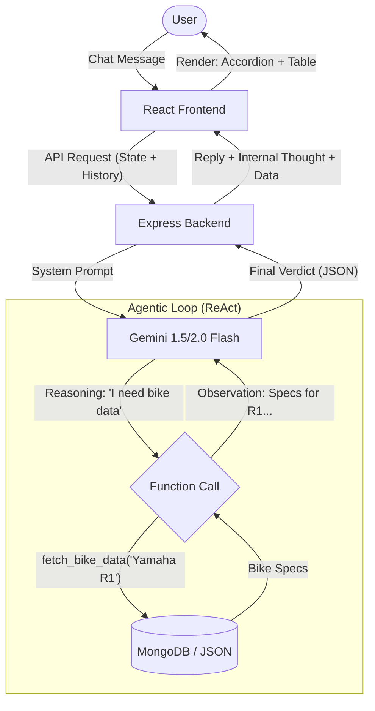

<div align="center">

# 🏍️ Blizzup Agentic Bike Dealership


A sophisticated, full-stack AI-driven bike dealership platform that leverages **Agentic AI** to provide deep technical comparisons, mathematical scoring, and automated inventory management.

</div>

## 🏗️ System Architecture

The core of the application is a **ReAct (Reason + Act)** agent loop built on Google Gemini. Unlike a traditional chatbot, this agent does not have the database in its prompt; it decides when to use tools to fetch real-world data.



## 📂 Project Directory Map

```text
blizzup-fullstack-assessment-main/
├── backend/                  # Express.js API & AI Agent Logic
│   ├── models/               # Mongoose Database Schemas
│   │   ├── Bike.js           # Bike inventory schema
│   │   └── User.js           # User schema
│   ├── server.js             # Main backend application entry point
│   ├── seed.js               # Database seeding utility
│   └── package.json          # Backend dependencies
├── frontend/                 # React UI Application
│   ├── public/               # Static assets
│   ├── src/
│   │   ├── components/       # Reusable React components
│   │   ├── context/          # Global state management
│   │   ├── layouts/          # Application structure layouts
│   │   ├── pages/            # Main views
│   │   ├── App.jsx           # Root application component
│   │   └── main.jsx          # React DOM mounting
│   ├── tailwind.config.js    # Tailwind CSS configuration
│   └── vite.config.js        # Vite bundler configuration
└── README.md                 # Project documentation
```

## ✨ Key Features

### 1. Agentic AI Comparison
- **Strict 6-Step Flow**: The agent maintains a state machine (Greeting → Collection → Analysis → Scoring → Recommendation).
- **Function Calling**: Real-time database retrieval using specific tools.
- **Explainable AI**: Transparent "Thinking Accordions" that show the AI's internal mathematical reasoning before the final verdict.

### 2. Intelligent Scoring System
- Automatic scoring across **5 mandatory metrics**:
  1. Price (20 pts)
  2. Fuel Average (20 pts)
  3. Engine Power (20 pts)
  4. Value for Money (20 pts)
  5. Features & Colors (20 pts)
- **High-Fidelity Table**: Dynamic comparison table with progress bars scaled to /20 per category.

### 3. Smart Inventory Management
- **AI Bulk Ingest**: Add multiple bikes by simply listing their names. The AI fetches specs and generates high-quality photographic prompts.
- **Vehicle Intelligence**: Distinguishes between Mountain Bikes and Superbikes to ensure accurate image generation.

## 🛠️ Tech Stack

- **Frontend**: React, Vite, Tailwind CSS, Lucide Icons.
- **Backend**: Node.js, Express, Mongoose.
- **AI/ML**: Google Gemini (via `@google/generative-ai`), Pollinations.ai (Image generation).
- **Database**: MongoDB Atlas.
- **Deployment**: Vercel (Frontend), Render (Backend).

## 🚀 Getting Started

### Prerequisites
- Node.js (v18+)
- MongoDB Atlas account (or local MongoDB)
- [Google AI Studio API Key](https://aistudio.google.com/)

### Environment Variables
Create a `.env` file in the `backend/` directory:
```env
PORT=5000
MONGO_URI=your_mongodb_uri
GEMINI_API_KEY=your_google_ai_key
JWT_SECRET=your_jwt_secret
```

### Installation
1. **Clone the Repo**
2. **Setup Backend**
   ```bash
   cd backend
   npm install
   node server.js
   ```
3. **Setup Frontend**
   ```bash
   cd frontend
   npm install
   npm run dev
   ```

## 🛡️ Administrative Features

### AI Image Repair
We included a self-healing utility to fix incorrect or low-quality thumbnails in the database. 
- **Endpoint**: `GET /api/bikes/admin/repair-images` (Used internally to refresh images to professional quality).
- **Duplicate Check**: The system automatically prevents the same bike/model combination from being added twice.

## 📝 Assessment Compliance
This project was built to fulfill the "Fullstack + AI Developer" assessment. It fulfills all mandatory requirements:
- [x] Responsive React UI
- [x] Node.js + MongoDB Backend
- [x] Real-time AI Tool Use (Function Calling)
- [x] Explainable Scoring (Step-by-step Math)
- [x] AI Bulk Ingest Feature

---

<div align="center">
  <i>Created by Antigravity for Blizzup Technologies.</i>
</div>
